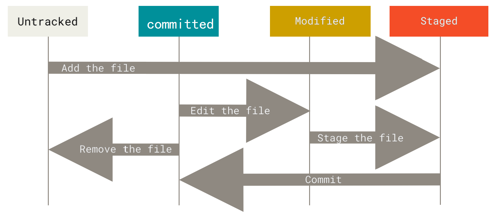
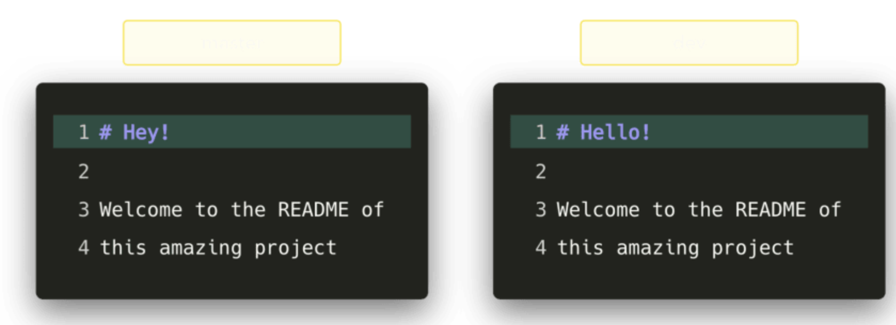

# 简介

本章为 Git 入门。 我们从介绍版本控制工具的背景知识开始，然后讲解如何在你的系统上运行 Git，最后是关于
如何设置 Git 以便开始工作。 通过本章的学习，你应该能了解为什么 Git 这么流行，为什么你应该使用 Git 以及
你应该如何设置以便使用 Git。

## 关于版本控制

* 什么是版本控制
  * 版本控制是一种记录一个或若干文件内容变化，以便将来查阅特定版本修订情况的系统。
  * 可以对任何类型的文件进行版本控制。
* 为什么要版本控制
  * 可以将某个文件回溯到之前的状态，甚至将整个项目都回退到过去某个时间点的状态
  * 可以比较文件的变化细节
    * 查出最后是谁修改了哪个地方
    * 找出导致怪异问题出现的原因
    * 谁在何时报告了某个功能缺陷等等

### 本地版本控制系统


许多人习惯用复制整个项目的方式来保存不同的版本，或许还会改名加上备份时间以示区别。这么做唯一的好处就是简单，但是特别容易犯错。有时候会混淆所在的工作目录，一不小心会写错文件或者覆盖意想外的文件。

为了解决这个问题，人们很久以前就开发了许多种本地版本控制系统，大多都是采用某种简单的数据库来记录文件的历次更新差异

其中最流行的一种叫做 RCS，现今许多计算机系统上都还看得到它的踪影。 RCS 的工作原理是在硬盘上保存补
丁集（补丁是指文件修订前后的变化）；通过应用所有的补丁，可以重新计算出各个版本的文件内容

### 集中化的版本控制系统


接下来人们又遇到一个问题，如何让在不同系统上的开发者协同工作？于是，集中化的版本控制系统（Centralized Version Control Systems，简称 CVCS）应运而生

集中化的版本控制系统都有一个单一的集中管理的服务器，保存所有文件的修订版本，而协同工作的人们都通过客户端连到这台服务器，取出最新的文件或者提交更新

这么做虽然解决了本地版本控制系统无法让在不同系统上的开发者协同工作的诟病，但也还是存在下面的问题：

- **单点故障：** 中央服务器宕机，则其他人无法使用；如果中心数据库磁盘损坏有没有进行备份，你将丢失所有数据。本地版本控制系统也存在类似问题，只要整个项目的历史记录被保存在单一位置，就有丢失所有历史更新记录的风险。
- **必须联网才能工作：** 受网络状况、带宽影响

### 分布式版本控制系统


于是分布式版本控制系统（Distributed Version Control System，简称 DVCS）面世了。 Git 就是一个典型的分布式版本控制系统。

这类系统，客户端并不只提取最新版本的文件快照，而是把代码仓库完整地镜像下来。 这么一来，任何一处协同工作用的服务器发生故障，事后都可以用任何一个镜像出来的本地仓库恢复。 因为每一次的克隆操作，实际上都是一次对代码仓库的完整备份

分布式版本控制系统可以不用联网就可以工作，因为每个人的电脑上都是完整的版本库，当你修改了某个文件后，你只需要将自己的修改推送给别人就可以了。但是，在实际使用分布式版本控制系统的时候，很少会直接进行推送修改，而是使用一台充当“中央服务器”的东西。这个服务器的作用仅仅是用来方便“交换”大家的修改，没有它大家也一样干活，只是交换修改不方便而已。

分布式版本控制系统的优势不单是不必联网这么简单，后面我们还会看到 Git 极其强大的分支管理等功能

## Git 简史

同生活中的许多伟大事物一样，Git 诞生于一个极富纷争大举创新的年代。

Linux 内核开源项目有着为数众多的参与者。 绝大多数的 Linux 内核维护工作都花在了提交补丁和保存归档的繁琐事务上（1991－2002年间）。 到 2002 年，整个项目组开始启用一个专有的分布式版本控制系统
BitKeeper 来管理和维护代码。

到了 2005 年，开发 BitKeeper 的商业公司同 Linux 内核开源社区的合作关系结束，他们收回了 Linux 内核社区
免费使用 BitKeeper 的权力。 这就迫使 Linux 开源社区（特别是 Linux 的缔造者 Linus Torvalds）基于使用
BitKeeper 时的经验教训，开发出自己的版本系统。 

他们对新的系统制订了若干目标：

- 速度

- 简单的设计
- 对非线性开发模式的强力支持（允许成千上万个并行开发的分支）
- 完全分布式
- 有能力高效管理类似 Linux 内核一样的超大规模项目（速度和数据量）

自诞生于 2005 年以来，Git 日臻成熟完善，在高度易用的同时，仍然保留着初期设定的目标。 它的速度飞快，极其适合管理大项目，有着令人难以置信的非线性分支管理系统（参见 Git 分支）。

## Git 是什么？

Git 在保存和对待各种信息的时候与其它版本控制系统有很大差异，尽管操作起来的命令形式非常相近，理解这些差异将有助于防止你使用中的困惑。

Git与其他版本管理系统的主要差别：**对待数据的方式**。

### 数据存储方式


- 差异比较：CVS、Subversion、Perforce、Bazaar 等大部分版本控制系统

  - 以文件变更列表的方式存储信息，这类系统**将它们保存的信息看作是一组基本文件和每个文件随时间逐步累积的差异。**
  - **原理**：每当我们提交更新一个文件之后，系统记录都会记录这个文件做了哪些更新，以增量符号Δ(Delta)表示
  - **怎样得到一个文件的最终版本呢？**很简单，高中数学的基本知识，我们只需要将这些原文件和这些增加进行相加就行了。

  - **缺点：**比如增量特别特别多的话，如果要得到最终的文件会耗费时间和性能。


- 记录快照：Git
  - Git 更像是把数据看作是对**小型文件系统**的一组快照，提供了许多以此为基础构建的超强工具，而不只是一个简单的 VCS。
  - **原理**：每次提交更新，或在 Git 中保存项目状态时，它对当前的全部文件制作一个快照并保存这个快照的索引。为了高效，如果文件没有修改，Git 不再重新存储该文件，而是只保留一个链接指向之前存储的文件。 Git 对待数据更像是一个**快照流**。

### 无需联网

在 Git 中的绝大多数操作都只需要访问本地文件和资源，一般不需要来自网络上其它计算机的信息。 如果你习惯于所有操作都有网络延时开销的集中式版本控制系统，Git 在这方面会让你感到速度之神赐给了 Git 超凡的能
量。 因为你在本地磁盘上就有项目的完整历史，所以大部分操作看起来瞬间完成。

举个例子，要浏览项目的历史，Git 不需外连到服务器去获取历史，然后再显示出来——它只需直接从本地数据
库中读取。 你能立即看到项目历史。如果你想查看当前版本与一个月前的版本之间引入的修改， Git 会查找到一个月前的文件做一次本地的差异计算，而不是由远程服务器处理或从远程服务器拉回旧版本文件再来本地处理。

这也意味着你在离线或者没有 VPN 时，几乎可以进行任何操作。 如你在飞机或火车上想做些工作，就能愉快地提交到你的本地副本，直到有网络连接时再上传。如你回家后 VPN 客户端不正常，那么也仍能工作。 使用其它系统的话，做到这些是不可能或很费力的。 比如，用 Perforce 的话，没有连接服务器时几乎不能做什么事；而用 Subversion 和 CVS 的话，你能修改文件，但不能向数据库提交修改（因为你的本地数据
库离线了）。

### 数据完整性

所有的数据在存储前都计算校验和，然后以校验和来引用。

用以计算校验和的机制叫做 SHA-1 散列（hash，哈希），这是一个由 40 个十六进制字符（0-9 和 a-f）组
成的字符串，基于Git 中文件的内容或目录结构计算出来。 SHA-1 哈希看起来是这样：Git 中使用这种哈希值的情况很多，你将经常看到这种哈希值。

```
24b9da6552252987aa493b52f8696cd6d3b00373
```

 实际上，Git 数据库中保存的信息都是**以文件内容的哈希值来索引**，而不是文件名

### 数据安全性

Git 操作，几乎只往 Git 数据库中添加数据。 你很难让 Git 执行任何不可逆操作，或者让它以任何方式清除数据。

一旦你提交快照到 Git 中，就难以再丢失数据，特别是如果你定期的推送数据库到其它仓库的话。
这使得我们使用 Git 成为一个安心愉悦的过程，因为我们深知可以尽情做各种尝试，而没有把事情弄糟的危险。

更深度探讨 Git 如何保存数据及恢复丢失数据的话题，请参考撤消操作

### 工作流程




- 工作目录下文件的两种状态：
  - 未跟踪：除已跟踪文件外的其它所有文件都属于未跟踪文件，它们既不存在于上次快照的记录中，也没有被放入暂存区
  - 已跟踪：被纳入了版本控制的文件，在上一次快照中有它们的记录
    - **已提交（committed）**：数据已经安全的保存在本地数据库中
    - **已修改（modified）**：已修改表示修改了文件，但还没保存到数据库中
    - **已暂存（staged）**：表示对一个已修改文件的当前版本做了标记，使之包含在下次提交的快照中

新建一个仓库之后，当前目录就成为了工作区，工作区下有一个隐藏目录 .git，它属于 Git 的版本库。Git 的版本库有一个称为 Stage 的暂存区以及最后的 History 版本库，History 存储所有分支信息，使用一个 HEAD 指针指向当前分支


- Git三个工作区域：
  - **Git 版本库(.git)**：新建仓库后的当前目录下的`.git`隐藏目录
    - 用来保存项目的元数据和对象数据库的地方，这是 Git 中最重要的部分，从其它计算机克隆仓库时，复制的就是这里的数据
    - **暂存区域(Staging Area)**：在 Git 仓库目录中，暂存区是一个文件，保存了下次将要提交的文件列表信息
      - 按照Git 的术语叫做“索引”
  - **工作目录**：新建仓库后的当前目录，除`.git`隐藏目录外
    - 从 Git 仓库的压缩数据库中对项目的某个版本独立提取出来的内容，用以使用或修改
- **基本的 Git 工作流程如下**：
  - 获得一个Git仓库
    - 初次克隆某个仓库的时候，工作目录中的所有文件都属于已跟踪文件，并处于未修改状态，因为 Git
      刚刚检出了它们，且尚未编辑过它们
  - 反复以下操作
    - 在工作目录中修改文件
    - 暂存修改过的文件，将文件的快照放入暂存区域
    - 提交更新，找到暂存区域的文件，将快照永久性存储到 Git 仓库目录

## 安装 Git

详见pro git

- Windows 用户：下载 [Git](https://npm.taobao.org/mirrors/git-for-windows/)、链接中为淘宝的镜像

  - cmd中使用git：需要把 Git 安装目录下的cmd文件夹加入 PATH 环境变量中

  - 或在 Git Bash 中使用 Git

  - git的更新：建议直接下载最新版本的git，安装会直接覆盖原版本

    - 也可以命令行中使用以下命令、但可能需要翻墙

      ```bash
      git update-git-for-windows
      ```

## 配置 Git

每台计算机上只需要配置一次，程序升级时会保留配置信息。可以在任何时候再次通过运行命令来修改它们。
Git 自带一个 git config 的工具来帮助设置控制 Git 外观和行为的配置变量。这些变量存储在三个不同的位置：

* `/etc/gitconfig` 文件: 包含系统上每一个用户及他们仓库的通用配置。在 Git 的安装目录下
  * 如果在执行 `git config` 时带上
    `--system` 选项，就会读写该文件中的配置变量。
  * 由于它是系统配置文件，因此你需要管理员或超级用户权限来修改它
* `~/.gitconfig` 或 `~/.config/git/config` 文件：只针对当前用户
  * 可以传递 `--global` 选项让 Git
    读写此文件，这会对系统上所有的仓库生效。
  * windows下对应 `$HOME` 目录中（一般情况下是 `C:\Users\$USER` ）的 .gitconfig 文件
* `.git/config`（即当前使用仓库的 Git 目录中的 config 文件）：针对该仓库。 
  * 默认情况下用的就是它
  * 每一个级别会覆盖上一级别的配置，所以 .git/config 的配置变量会覆盖 /etc/gitconfig 中的配置变量
* 在 Windows 上使用 Git 2.x 以后的版本，那么还有一个系统级的配置文件
  * Windows XP 上在
    `C:\Documents and Settings\All Users\Application Data\Git\config`
  * Windows Vista 及更新
    的版本在 `C:\ProgramData\Git\config` 
  * 此文件只能以管理员权限通过 `git config -f <file>` 来修改。

### 用户信息

安装完 Git 之后，要做的第一件事就是设置你的用户名和邮件地址。 这一点很重要，因为每一个 Git 提交都会使用这些信息，它们会写入到你的每一次提交中，不可更改：

```bash
$ git config --global user.name "John Doe"
$ git config --global user.email johndoe@example.com
```

再次强调，如果使用了 --global 选项，那么该命令只需要运行一次，因为之后无论你在该系统上做任何事
情， Git 都会使用那些信息。 当你想针对特定项目使用不同的用户名称与邮件地址时，可以在那个项目目录下运
行没有 --global 选项的命令来配置。
很多 GUI 工具都会在第一次运行时帮助你配置这些信息。

### 查看配置信息

可以通过以下命令查看所有的配置以及它们所在的文件：

```bash
git config --list --show-origin
```

也可以查看具体的某一项配置：`git config <属性名>`

```bash
git config user.name
```


## 获取帮助

* 获取帮助文档

  ```bash
  git help <命令名称>	
  git <命令名称> --help
  man git-<命令名称>
  ```

* 获取简短帮助

  ```bash
  git <命令名称> -h
  ```

# 命令

## 创建仓库

- 本地创建：

  ```bash
  $ git init                	#将当前的目录转换成一个 Git 仓库
                              #并在项目的根目录下创建新的.git目录，其中包含项目必需的所有元数据。
                              #除了 `.git` 目录之外，已经存在的项目不会被改变
  $ git init <directory>			#将指定路径的目录转换成一个 Git 仓库
  ```

  - 将本地仓库与一个 GitHub 上的空仓库连接起来

    ```bash
    $ git remote add origin [url]
    ```

- clone 一个url指向的仓库，包括所有的文件、分支和提交(commits)

  ```bash
  $ git clone [url]
  $ git clone <url> 目录名 #在克隆远程仓库的时候，通过额外的参数自定义本地仓库的名字
  ```
  - url：
    - 本地仓库的路径
    - SSH：`git clone username@host:/path/to/repository` `
    - Https：`git clone https://github.com/geeeeeeeeek/git-recipes.git`
      - 使用github时速度会很慢，可以将url换成对应的镜像网站`github.com.cnpmjs.org`

## 进行更改

- 将内容添加到下一次提交中（即添加到暂存区）：

  ```bash
  $ git add 文件名/目录路径 	 #参数是目录的路径将递归地跟踪该目录下的所有文件
  $ git add *								#添加所有文件
  $ git add *.txt 					#所有 .txt 文件，支持适用通配符
  ```

- **提交更新**：只会将暂存区中的文件提交在本地仓库，每次提交时必须输入提交说明

  ```bash
  $ git commit  #将打开默认文本编辑器，需要在第一行输入提交说明
  $ git commit -m "提交说明"
  $ git commit -a -m "提交说明"   #自动把所有已经跟踪过的文件暂存起来一并提交，跳过git add步骤
  ```

- **移除文件**：删除文件并提交修改到暂存区

  ```bash
  $ git rm filename						#不让追踪的同时，从磁盘删除
  $ git rm --cached filename  #将文件保留在磁盘，但并不想让git追踪
  ```

  * **使用`git rm`删除和直接从目录手动删除的区别**？

    * 使用`git rm`删除相当于以下两条命令的合集，而

      ```bash
      rm 文件名       #直接删除只是做了这一步
      							 #之后将一直提示该文件已修改未暂存
      git add 文件名
      ```

      * 使用命令删除后，删除文件的操作将作为对文件修改提交到暂存区中，下一次提交后文件就消失在了git中
      * 若直接删除文件，对文件的删除操作并没有提交到暂存区，下一次提交后并不会消失在git中，

-  **对文件重命名**：

   ```bash
   $ git mv 文件名 新文件名
   #等价于
   $ mv README.md README  #直接在目录中修改文件名只进行了这一步
   											#在后续查看状态时将一直提示README.md被删除但未暂存，而README未跟踪
   $ git rm README.md
   $ git add README
   ```


展示两个分支之间的内容差异

```
$ git show [commit]
```

输出指定commit的元数据和内容变化

## 检查仓库状态

- 列出已缓存、未缓存、未追踪的文件

  ```bash
  $ git status  #输出十分详细，但其用语有些繁琐，也可以 -s 选项
  		Untracked files:表示未跟踪的文件
  		Changes to be committed:表示已暂存的文件
  		Changes not to be committed:表示已修改已跟踪但未暂存的文件
  $ git status -s #注意空格
  		??:新添加的未跟踪文件
  		A:新添加到暂存区中的文件
  		M :已修改已暂存   
  		 M:已修改未暂存
  		MM:文件的修改中即存在已暂存的部分，也存在未暂存的部分，即修改后暂存，然后又进行了修改
  ```

- 显示项目的历史提交记录

  - 建议直接用`gitk`进入图形化界面观看

  ```bash
  $ git log										#列出每个提交的SHA-1校验和、作者的名字和电子邮件地址、提交时间以及提交说明
  														#按时间先后顺序列出所有的提交，最近的更新排在最上面
  $ git log --follow [file]
  $ git log --oneline					#将每个提交压缩到一行。当你需要查看项目历史的上层情况时这会很有用。
  $ git log -n 3							#只会显示 3 个提交
  $ git log --author = ""     #搜索特定作者的提交,可以是字符串或正则表达式。
  $ git log -p								#显示每个提交全部的差异（diff）,这也是项目历史中最详细的视图
  $ git log <file>						#只显示包含特定文件的提交。查找特定文件的历史这样做会很方便。
  $ git log <since>..<until>	#只显示发生在 `<since>` 和 `<until>` 之间的提交。两个参数可以是提交 ID、分支名、`HEAD` 或是任何一种引用
  $ git log --grep=""					#搜索提交信息匹配特定 `<pattern>` 的提交。`<pattern>` 可以是字符串或正则表达式
  $ git log --stat						#除了命令git log显示的信息外，多了哪些文件被更改了、每个文件相对的增删行数的信息
  ```

- 列出文件的版本历史，包括重命名

  ```bash
  $ git diff [first-branch]...[second-branch]
  ```

## 分支

分支是使用 Git 工作的一个重要部分。你做的任何提交都会发生在当前“checked out”到的分支上。使用 `git status` 查看那是哪个分支

- 创建一个新分支

  ```bash
  $ git branch branch-name
  ```

- 检出文件、检出提交和检出分支

  ```bash
  $ git checkout [branch-name]   	#切换到指定分支
  $ git checkout <commit> <file>	#查看文件之前的版本
  																#将工作目录中的<file>文件变成<commit>中那个文件的拷贝，并将其加入暂存区
  																#HEAD作为<commit>时表示最近的版本
  																#此时旧的文件版本会显示为「需要提交的更改」，允许回滚到文件之前的版本
  $ git checkout <commit>					#更新工作目录中的所有文件，使得和某个特定提交中的文件一致
  																#可以将提交的哈希字串，或是标签作为 `<commit>` 参数
  																#查看文件，编译项目，运行测试，甚至编辑文件,若要提交会开始新的分支
  $ git checkout -b branch-name		#创建一个新分支并切换过去														
  ```

- 


```
$ git merge [branch]
```

将指定分支的历史合并到当前分支。这通常在拉取请求(PR)中完成，但也是一个重要的 Git 操作。

```
$ git branch -d [branch-name]
```

删除指定分支

## 储藏（Stashing）

在一个分支上操作之后，如果还没有将修改提交到分支上，此时进行切换分支，那么另一个分支上也能看到新的修改。这是因为所有分支都共用一个工作区的缘故。

可以使用 git stash 将当前分支的修改储藏起来，此时当前工作区的所有修改都会被存到栈中，也就是说当前工作区是干净的，没有任何未提交的修改。此时就可以安全的切换到其它分支上了。

```
$ git stash
Saved working directory and index state \ "WIP on master: 049d078 added the index file"
HEAD is now at 049d078 added the index file (To restore them type "git stash apply")
```

该功能可以用于 bug 分支的实现。如果当前正在 dev 分支上进行开发，但是此时 master 上有个 bug 需要修复，但是 dev 分支上的开发还未完成，不想立即提交。在新建 bug 分支并切换到 bug 分支之前就需要使用 git stash 将 dev 分支的未提交修改储藏起来。

## 回滚

使用 rm 和 clean 做的修改无法回滚

- 还原（Reverting）：通过一个逆修改，进行一次新的提交，从而实现回滚：适合在中央仓库中使用

  ```bash
  $ git revert <commit>					#生成一个撤消了<commit>引入的修改的新提交，然后应用到当前分支
  ```

- 重置（Resetting）：通过移除提交，从而实现回滚：禁止在中央仓库中使用reset，reset 只影响被跟踪的文件

  ```bash
  $ git reset										#重置暂存区，匹配最近的一次提交，但工作目录不变。
  															#不改变工作目录。所有<commit>之后的更改会保留在工作目录中
  $ git reset <file>						#从缓存区移除特定文件，但不改变工作目录
  $ git reset --hard						#将当前分支的末端移到<commit>，将缓存区重设到这个提交
  $ git reset [commit]					#撤销所有 [commit] 后的的提交，在本地保存更改
  $ git reset --hard [commit]		#将当前分支的末端移到 `<commit>`，将缓存区和工作目录都重设到这个提交
  															#它不仅清除了未提交的更改，同时还清除了 <commit> 之后的所有提交。
  $ git reset HEAD~2						#将当前分支向前倒退两个提交		
  ```

- 将未跟踪的文件从工作目录中移除

  - `git clean` 命令对于 build 后清理工作目录十分有用。比如，它可以轻易地删除 C 编译器生成的 `.o` 和 `.exe` 二进制文件。这通常是打包发布前需要的一步。`-x` 命令在这种情况下特别方便

  ```bash
  $ git clean -n				#告诉你哪些文件在命令执行后会被移除，而不是真的删除它。
  $ git clean -f				#移除当前目录下未被跟踪的文件。`-f`（强制）标记是必需的，
  											#除非 `clean.requireForce` 配置项被设为了 `false`（默认为 `true`）。
  											#它不会删除 `.gitignore` 中指定的未跟踪的文件。
  $ git clean -f <path>	#移除某个路径下未跟踪的文件
  $ git clean -df				#移除未跟踪的文件，以及目录。
  $ git clean -xf				#移除当前目录下未跟踪的文件，以及 Git 一般忽略的文件
  ```


## .gitignore 文件

有时一些文件（自动生成的文件，比如日志文件，或者编译过程中创建的临时文件等）最好不要用 Git 跟踪。这通常在名为 `.gitignore` 的特殊文件中完成。可以在[github.com/github/gitignore](https://github.com/github/gitignore) 找到有用的 `.gitignore` 文件模板。

- 示例

  ```bash
  # 忽略所有的 .a 文件
  *.a
  # 但跟踪所有的 lib.a，即便你在前面忽略了 .a 文件
  !lib.a
  # 只忽略当前目录下的 TODO 文件，而不忽略 subdir/TODO
  /TODO
  # 忽略任何目录下名为 build 的文件夹
  build/
  # 忽略 doc/notes.txt，但不忽略 doc/server/arch.txt
  doc/*.txt
  # 忽略 doc/ 目录及其所有子目录下的 .pdf 文件
  doc/**/*.pdf
  ```

- 在最简单的情况下，一个仓库可能只根目录下有一个 .gitignore 文件，它递归地应用到整个仓库中
  - 子目录下也可以有额外的 .gitignore 文件。子目录中的 .gitignore
    文件中的规则只作用于它所在的目录中
- 格式规范：
  - 所有空行或者以 # 开头的行都会被 Git 忽略
  - 匹配模式可以以（/）开头防止递归
  - 匹配模式可以以（/）结尾指定目录
  - 要忽略指定模式以外的文件或目录，可以在模式前加上叹号（!）取反
  - 可以使用标准的 glob 模式匹配，它会递归地应用在整个工作区中
    - 即 shell 所使用的简化了的正则表达式
      - 星号 `*` 匹配零个或多个任意字符
      - [abc] 匹配任何一个列在方括号中的字符
        - 这个例子要么匹配一个 a，要么匹配一个 b，要么匹配一个 c
      - 问号 `?` 只匹配一个任意字符
      - 如果在方括号中使用短划线分隔两个字符，表示所有在这两个字符范围内的都可以匹配
        （比如 [0-9] 表示匹配所有 0 到 9 的数字）
      - 使用两个星号 `**` 表示匹配任意中间目录 
        - 比如：a/**/z 可以
          匹配 a/z、a/b/z或 a/b/c/z等

## 同步更改

将你本地仓库与 GitHub.com 上的远端仓库同步

```
$ git fetch
```

下载远端跟踪分支的所有历史

```
$ git merge
```

将远端跟踪分支合并到当前本地分支

```
$ git push
```

将所有本地分支提交上传到 GitHub

```
$ git pull
```

使用来自 GitHub 的对应远端分支的所有新提交更新你当前的本地工作分支。`git pull` 是 `git fetch` 和 `git merge` 的结合

## 术语表

* **git**: 一个开源的分布式版本控制系统
* **GitHub**: 一个托管和协作管理 Git 仓库的平台
* **commit 提交**: 一个 Git 对象，是你整个仓库的快照的哈希值
* **branch 分支**: 一个轻型可移动的 commit 指针
* **clone**: 一个仓库的本地版本，包含所有提交和分支
* **remote 远端**: 一个 GitHub 上的公共仓库，所有小组成员通过它来交换修改
* **fork**: 一个属于另一用户的 GitHub 上的仓库的副本
* **pull request 拉取请求**: 一处用于比较和讨论分支上引入的差异，且具有评审、评论、集成测试等功能的地方
* **HEAD**: 代表你当前的工作目录。使用`git checkout` 可移动 HEAD 指针到不同的分支、标记(tags)或提交
  * 「分离 `HEAD`」状态：不再指向一个分支了，而是指向一个提交

# 动图

## 合并

拥有多个分支是很方便的，这样可以将不同的新修改互相隔离开，而且还能确保你不会意外地向生产代码推送未经许可或破损的代码修改。但一旦这些修改得到了批准许可，我们就需要将其部署到我们的生产分支中！

可将一个分支的修改融入到另一个分支的一种方式是执行 git merge。Git 可执行两种类型的合并：fast-forward 和 no-fast-forward。现在你可能分不清，但我们马上就来看看它们的差异所在。

### Fast-forward (—ff)


在当前分支相比于我们要合并的分支没有额外的提交（commit）时，可以执行 fast-forward 合并。Git 很懒，首先会尝试执行最简单的选项：fast-forward！这类合并不会创建新的提交，而是会将我们正在合并的分支上的提交直接合并到当前分支。

完美！现在，我们在 dev 分支上所做的所有改变都合并到了 master 分支上。那么 no-fast-forward 又是什么意思呢？

### No-fast-foward (—no-ff)


如果你的当前分支相比于你想要合并的分支没有任何提交，那当然很好，但很遗憾现实情况很少如此！如果我们在当前分支上提交我们想要合并的分支不具备的改变，那么 git 将会执行 no-fast-forward 合并。

使用 no-fast-forward 合并时，Git 会在当前活动分支上创建新的 merging commit。这个提交的父提交（parent commit）即指向这个活动分支，也指向我们想要合并的分支！

没什么大不了的，完美的合并！现在，我们在 dev 分支上所做的所有改变都合并到了 master 分支上。

## 合并冲突

尽管 Git 能够很好地决定如何合并分支以及如何向文件添加修改，但它并不总是能完全自己做决定。当我们想要合并的两个分支的同一文件中的同一行代码上有不同的修改，或者一个分支删除了一个文件而另一个分支修改了这个文件时，Git 就不知道如何取舍了。

在这样的情况下，Git 会询问你想要保留哪种选择？假设在这两个分支中，我们都编辑了 README.md 的第一行。



如果我们想把 dev 合并到 master，就会出现一个合并冲突：你想要标题是 Hello! 还是 Hey!？

当尝试合并这些分支时，Git 会向你展示冲突出现的位置。我们可以手动移除我们不想保留的修改，保存这些修改，再次添加这个已修改的文件，然后提交这些修改。


完成！尽管合并冲突往往很让人厌烦，但这是合理的：Git 不应该瞎猜我们想要保留哪些修改。

## 变基（Rebasing）


我们刚看到可通过执行 git merge 将一个分支的修改应用到另一个分支。另一种可将一个分支的修改融入到另一个分支的方式是执行 git rebase。

git rebase 会将当前分支的提交复制到指定的分支之上。

完美，现在我们在 dev 分支上获取了 master 分支上的所有修改。

变基与合并有一个重大的区别：Git 不会尝试确定要保留或不保留哪些文件。我们执行 rebase 的分支总是含有我们想要保留的最新近的修改！这样我们不会遇到任何合并冲突，而且可以保留一个漂亮的、线性的 Git 历史记录。

上面这个例子展示了在 master 分支上的变基。但是，在更大型的项目中，你通常不需要这样的操作。git rebase 在为复制的提交创建新的 hash 时会修改项目的历史记录。

如果你在开发一个 feature 分支并且 master 分支已经更新过，那么变基就很好用。你可以在你的分支上获取所有更新，这能防止未来出现合并冲突。

### 交互式变基（Interactive Rebase）

在为提交执行变基之前，我们可以修改它们！我们可以使用交互式变基来完成这一任务。交互式变基在你当前开发的分支上以及想要修改某些提交时会很有用。


在我们正在 rebase 的提交上，我们可以执行以下 6 个动作：

* reword：修改提交信息；
* edit：修改此提交；
* squash：将提交融合到前一个提交中；
* fixup：将提交融合到前一个提交中，不保留该提交的日志消息；
* exec：在每个提交上运行我们想要 rebase 的命令；
* drop：移除该提交。

很棒！这样我们就能完全控制我们的提交了。如果你想要移除一个提交，只需 drop 即可。


如果你想把多个提交融合到一起以便得到清晰的提交历史，那也没有问题！


交互式变基能为你在 rebase 时提供大量控制，甚至可以控制当前的活动分支。

## 重置（Resetting）


当我们不想要之前提交的修改时，就会用到这个命令。也许这是一个 WIP 提交或者可能是引入了 bug 的提交，这时候就要执行 git reset。

git reset 能让我们不再使用当前台面上的文件，让我们可以控制 HEAD 应该指向的位置。

### 软重置


软重置会将 HEAD 移至指定的提交（或与 HEAD 相比的提交的索引），而不会移除该提交之后加入的修改！

假设我们不想保留添加了一个 style.css 文件的提交 9e78i，而且我们也不想保留添加了一个 index.js 文件的提交 035cc。但是，我们确实又想要保留新添加的 style.css 和 index.js 文件！这是软重置的一个完美用例。

输入 git status 后，你会看到我们仍然可以访问在之前的提交上做过的所有修改。这很好，这意味着我们可以修复这些文件的内容，之后再重新提交它们！

### 硬重置


有时候我们并不想保留特定提交引入的修改。不同于软重置，我们应该再也无需访问它们。Git 应该直接将整体状态直接重置到特定提交之前的状态：这甚至包括你在工作目录中和暂存文件上的修改。

Git 丢弃了 9e78i 和 035cc 引入的修改，并将状态重置到了 ec5be 的状态。

## 还原（Reverting）


另一种撤销修改的方法是执行 git revert。通过对特定的提交执行还原操作，我们会创建一个包含已还原修改的新提交。

假设 ec5be 添加了一个 index.js 文件。但之后我们发现其实我们再也不需要由这个提交引入的修改了。那就还原 ec5be 提交吧！

完美！提交 9e78i 还原了由提交 ec5be 引入的修改。在撤销特定的提交时，git revert 非常有用，同时也不会修改分支的历史。

## 拣选（Cherry-picking）


当一个特定分支包含我们的活动分支需要的某个提交时，我们对那个提交执行 cherry-pick！对一个提交执行 cherry-pick 时，我们会在活动分支上创建一个新的提交，其中包含由拣选出来的提交所引入的修改。

假设 dev 分支上的提交 76d12 为 index.js 文件添加了一项修改，而我们希望将其整合到 master 分支中。我们并不想要整个 dev 分支，而只需要这个提交！

现在 master 分支包含 76d12 引入的修改了。

## 取回（Fetching）


如果你有一个远程 Git 分支，比如在 GitHub 上的分支，当远程分支上包含当前分支没有的提交时，可以使用取回。比如当合并了另一个分支或你的同事推送了一个快速修复时。

通过在这个远程分支上执行 git fetch，我们就可在本地获取这些修改。这不会以任何方式影响你的本地分支：fetch 只是单纯地下载新的数据而已。

现在我们可以看到自上次推送以来的所有修改了。这些新数据也已经在本地了，我们可以决定用这些新数据做什么了。

## 拉取（Pulling）


尽管 git fetch 可用于获取某个分支的远程信息，但我们也可以执行 git pull。git pull 实际上是两个命令合成了一个：git fetch 和 git merge。当我们从来源拉取修改时，我们首先是像 git fetch 那样取回所有数据，然后最新的修改会自动合并到本地分支中。

很好，我们现在与远程分支完美同步了，并且也有了所有最新的修改！

## Reflog


每个人都会犯错，但犯错其实没啥！有时候你可能感觉你把 git repo 完全搞坏了，让你想完全删了了事。

git reflog 是一个非常有用的命令，可以展示已经执行过的所有动作的日志。包括合并、重置、还原，基本上包含你对你的分支所做的任何修改。

如果你犯了错，你可以根据 reflog 提供的信息通过重置 HEAD 来轻松地重做！

假设我们实际上并不需要合并原有分支。当我们执行 git reflog 命令时，我们可以看到这个 repo 的状态在合并前位于 HEAD@{1}。那我们就执行一次 git reset，将 HEAD 重新指向在 HEAD@{1} 的位置。

我们可以看到最新的动作已被推送给 reflog。

